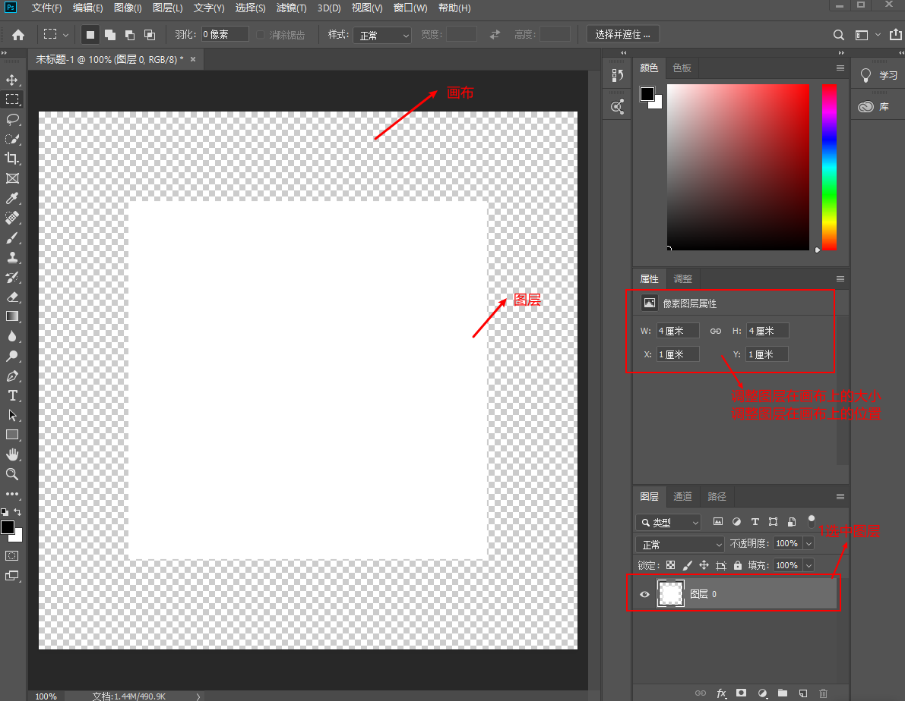
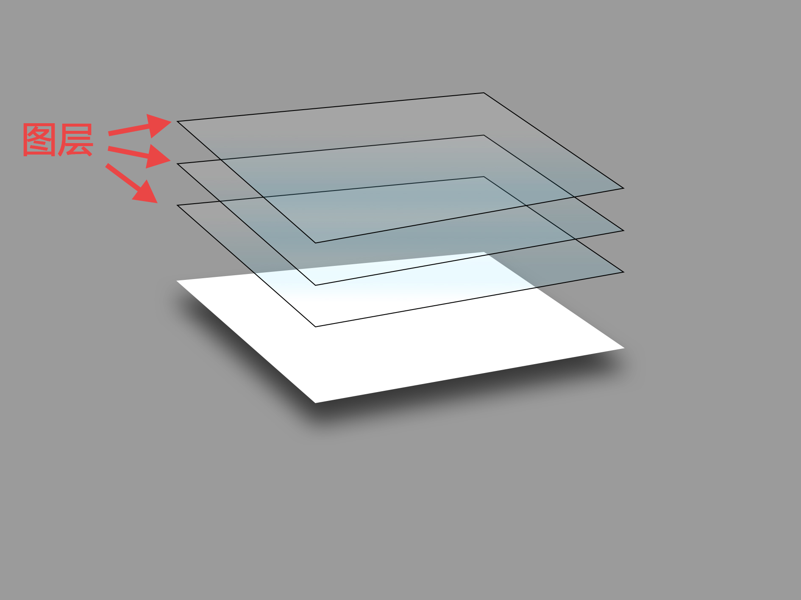
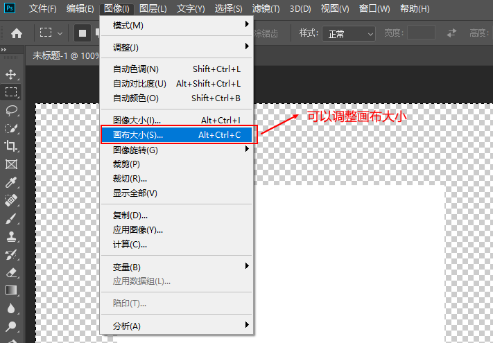
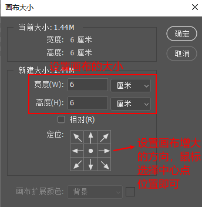

# 画布和图层    

## 1 画布   
- 画布是不能删除的，是底图。决定你的画的大小，长宽比例。   

   

## 2 图层   
- 可以想像是透明的胶纸(实际是黑白相间的格网)，有前后的关系，可以在不同层次的胶纸上画上图案。   

     

## 3 图像   
- 就是画在胶纸（图层）上的图案。    

## 4 基本用法    
   

   

## 5 注意事项   
- **只有调整图层在画布上，才能显示出完成的图像**   
- 注意调整图层的坐标    

## 6 参考资料   
1. https://www.zhihu.com/question/65237044   